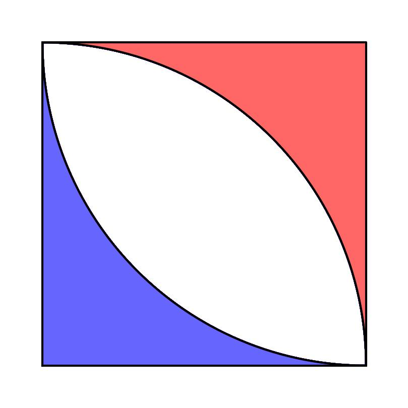
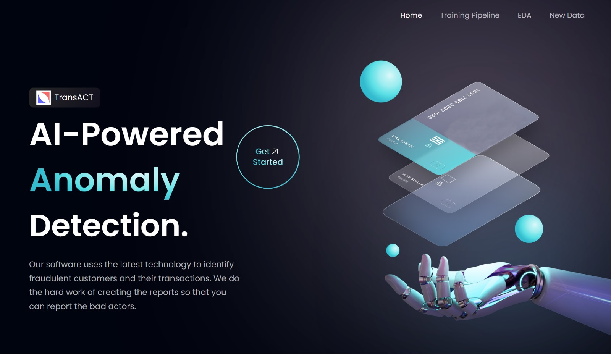

<!-- Source: https://github.com/othneildrew/Best-README-Template/pull/73 -->
<a name="readme-top"></a>

<!-- PROJECT LOGO -->
<br />
<div align="center">
  <a href="https://github.com/knamdar/IMI_BigData_AI_Hub_Competition_2024_2025">
    
  </a>

  <h3 align="center">Team 25 - TransACT</h3>
  <h4 align="center">Transforming Anomalous Customer Tracking through AI</h4>

  <p align="center">
    2024-2025 IMI Big Data and Artificial Intelligence Competition
    <br />
    <a href="https://github.com/knamdar/IMI_BigData_AI_Hub_Competition_2024_2025/tree/main/documents"><strong>Explore the docs »</strong></a>
    <br />
    <br />
  </p>
</div>

<!-- TABLE OF CONTENTS -->
<details>
  <summary>Table of Contents</summary>
  <ol>
    <li><a href="#the-team">The Team</a></li>
    <li><a href="#getting-started">Getting Started</a></li>
    <li><a href="#license">License</a></li>
    <li><a href="#contact">Contact</a></li>
    <li><a href="#acknowledgments">Acknowledgments</a></li>
  </ol>
</details>

<!-- ABOUT THE PROJECT -->
## The Team

* Ernest Namdar
* Tanishka Gupta
* Tanmay Sethi
* Timothy Williams
* Tanish Sharma

<p align="right">(<a href="#readme-top">back to top</a>)</p>

### Built With

![PyTorch][pytorch]


<p align="right">(<a href="#readme-top">back to top</a>)</p>

<!-- GETTING STARTED -->
## Getting Started

The pipeline follows a modular design, with dedicated directories for exploratory data analysis (EDA), training, and inference in the backend, along with corresponding interfaces on the front end. Each module is organized into separate directories for code, inputs, and results.



```diff
- Note: Each module has its own README file, and the structure of subdirectories is unified.
```

<!-- LICENSE -->
## License

Distributed under the MIT License. See `LICENSE.txt` for more information.

<p align="right">(<a href="#readme-top">back to top</a>)</p>

<!-- CONTACT -->
## Contact

* Ernest Namdar - [@LinkedIn](https://www.linkedin.com/in/ernest-namdar/) - ernest.namdar@utoronto.ca

Project Link: [https://github.com/knamdar/IMI_BigData_AI_Hub_Competition_2024_2025](https://github.com/knamdar/IMI_BigData_AI_Hub_Competition_2024_2025)

<p align="right">(<a href="#readme-top">back to top</a>)</p>

<!-- ACKNOWLEDGMENTS -->
## Acknowledgments

The resources we found helpful and would like to give credit to.

* [Creating the README](https://github.com/othneildrew/Best-README-Template)

<p align="right">(<a href="#readme-top">back to top</a>)</p>

<!-- MARKDOWN LINKS & IMAGES -->

[pytorch-url]: https://pytorch.org
[pytorch]: https://img.shields.io/badge/PyTorch-EE4C2C.svg?style=for-the-badge&logo=PyTorch&logoColor=white
[scikit-learn-url]: https://scikit-learn.org
[scikit-learn]: https://img.shields.io/badge/scikitlearn-F7931E.svg?style=for-the-badge&logo=scikit-learn&logoColor=white